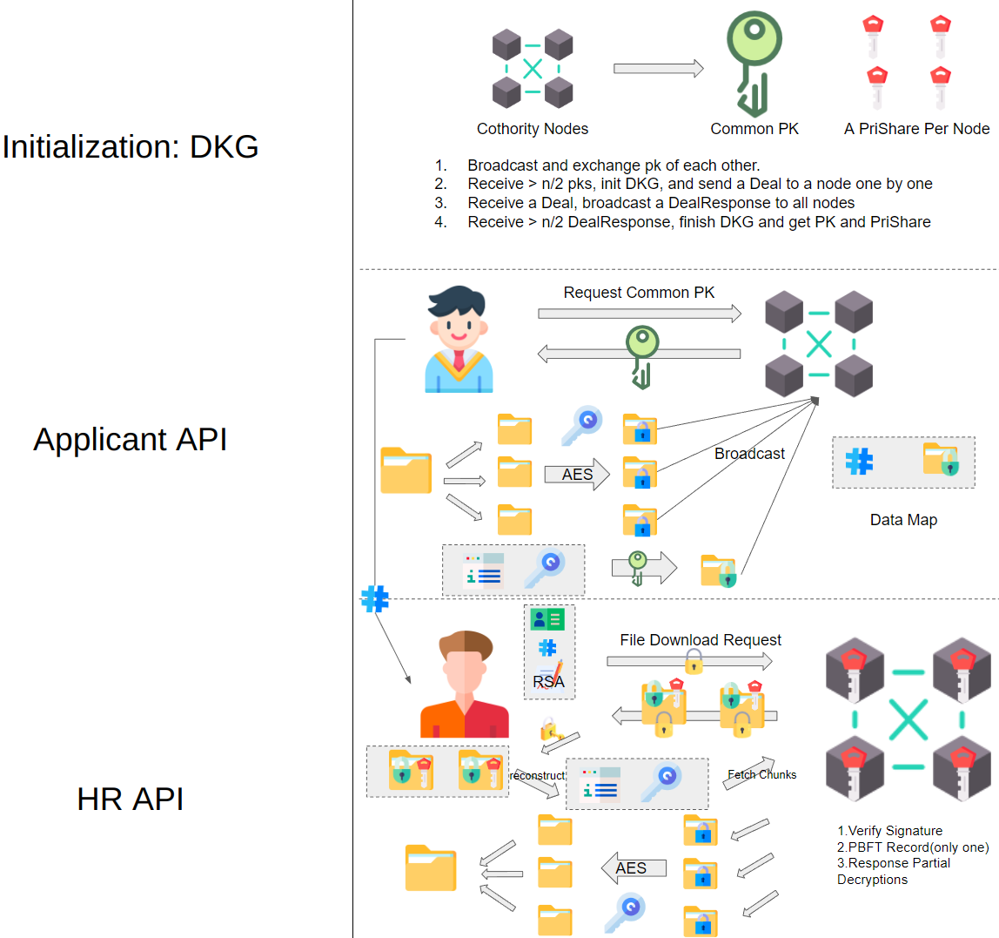
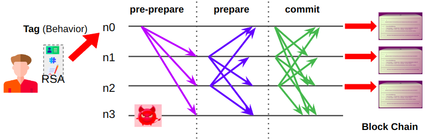

# Distributed Job Application Portal

A robust and privacy-enhancing peer-to-peer job application portal developed in the "CS-438 Decentralized System Engineering" course, supported by the DEDIS lab at EPFL.



Achieve consensus on the decision orders among the distributed storage system based on PBFT algorithm. This consensus is guaranteed in a robust manner, which tolerates arbitrary behaviors even if less than one third of the nodes are malicious:



## Configure
Now we have 3 configure files for 3 nodes, and they have their roles. Such configures will be read in `projectconfig := ReadJSON(c.String("configpath"))` in `gui/mod.go`. You can modify them if you want.
```sh
{
    "Role": [
        "CN",
        "HR"
    ],
    "Index": 0,
    "Addresses": [   
        "127.0.0.1:1025",
        "127.0.0.1:1026",
        "127.0.0.1:1027"
    ],
    "HRSecretTable": {
        "123": "12345678"
    },
    "ID": 123,
    "Secret": "12345678",
    "Num": 3
}
```


## Quick Setup

Install go >= 1.19.

New a console in `gui`, and run the following:

```sh
go run mod.go start --configpath ./config_0.json
```

New a console in `gui`, and run the following:

```sh
go run mod.go start --configpath ./config_1.json
```

New a console in `gui`, and run the following:

```sh
go run mod.go start --configpath ./config_2.json
```

You need to open 3 `gui/web/index.html` in your browser. In each of them, enter the peer's proxy
address provided by the peer's log: `proxy server is ready to handle requests at
'127.0.0.1:xxxx'`. You can run as many peers as wanted and connect them together
using the "routing table" > "add peer" section in the WEB GUI.

## Operation

You may upload a file in node-1(its role is applicant) and download the file in node-0(its role is HR).

## Test for DKG

Navigate to the ./peer/tests/unit folder

```sh
cd ./peer/tests/unit
```

In dkg_test.go, you can change the number of nodes if you want, but you need to increase the sleep time and corrsponding timeout. Notice that we enforce that every cothority will sleep around 10s to reach synchronization in Web Demo.
```sh
go test -v -race -run Test_DKG -timeout 45s
```


## Test for PBFT

Navigate to the ./peer/tests/unit folder

```sh
cd ./peer/tests/unit
```

PBFT experiment results when there is no malicious node

```sh
go test -v -race -run Test_PBFT_no_malicious
```

PBFT experiment results when (N-1)/3 of the nodes are malicious

```sh
go test -v -race -run Test_PBFT_one_malicious
```


## Test for PLUMTREE
Make sure the usePlumTree = true in ./peer/impl/settings 
Navigate to the ./peer/tests/unit folder

```sh
cd ./peer/tests/unit
```

Five nodes with sample topology sending 20 messages and node 3 down before sending msg 10

```sh
go test -v -race -run Test_PlumTree_Messaging_Broadcast_Rumor_Simple
```

Five nodes with sample topology sending 1 message and check whether the received message is to our expextation
```sh
go test -v -race -run Test_PlumTree_Messaging_Broadcast_Rumor_Down
```

random topology big graph sending 1 message with no node goes down
```sh
go test -v -race -run Test_PlumTree_Messaging_Broadcast_BigGraph
```
